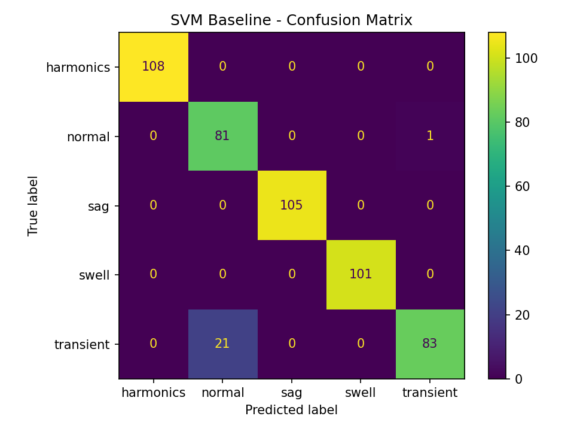

# Signal-To-Image-Power-Quality-Classification
Comparative study of SVM (engineered features) and CNN (spectrogram images) for electrical disturbance classification.
## Results

### Quantitative Comparison

| Method | Input Representation | Accuracy | Macro F1 |
|---|---|---:|---:|
| SVM (RBF) | Handcrafted time/frequency features | 0.956 | 0.953 |
| CNN (MobileNetV2) | Spectrogram images (signal-to-image) | 0.956 | 0.953 |

### Notes
- The SVM baseline uses engineered electrical features (e.g., RMS, crest factor, harmonic band energies / THD proxy).
- The CNN model learns discriminative time–frequency patterns from spectrogram images via transfer learning (MobileNetV2).
- On this synthetic dataset, both approaches perform strongly; the CNN approach is especially attractive when scaling to more complex real-world signals and larger datasets.

- ## Confusion Matrices

SVM:

